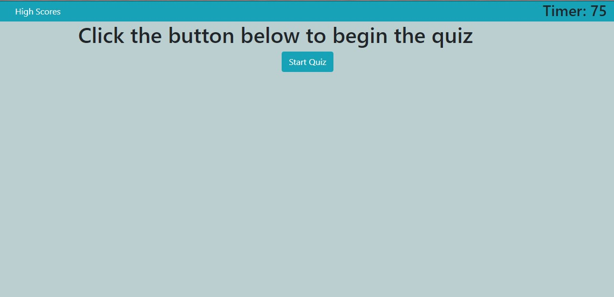
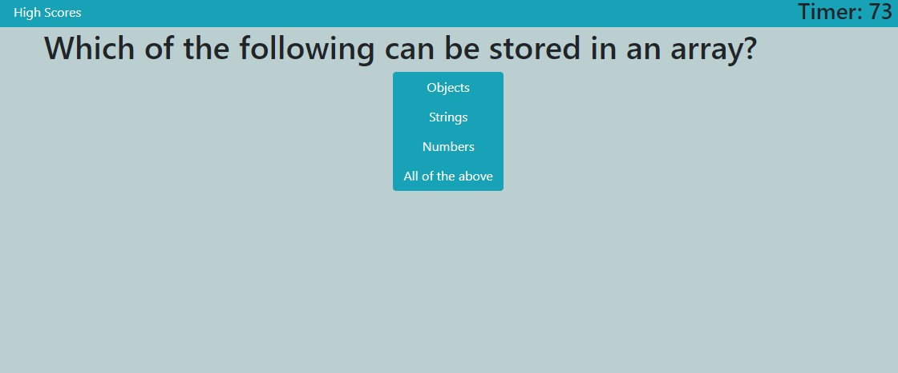
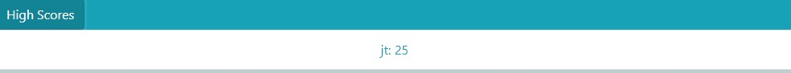

# Code Quiz

## What it is

This is a multiple-choice javascript quiz.

## Where it is

The live deployment of this quiz is located here <https//juliet2319.github.io/code-quiz/>

## How to use it

On the start screen click the start button to begin the quiz. 15 seconds will be given for each question in the quiz, and time will count down to 0.  

The game will end when you have either answered all the questions or your timer has reached 0.

When the game ends, enter your initials to save your score to the local storage.

To view the scores of previous play throughs, click on the High Scores button on the top left of the screen. The list of scores will display. Clicking the button again will hide the list of scores.
